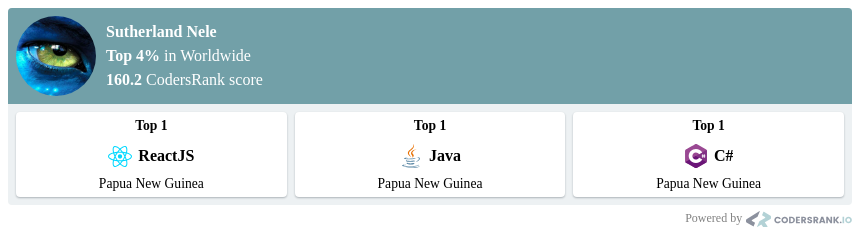

```diff

███████╗░█████╗░████████╗  ░██████╗██╗░░░░░███████╗███████╗██████╗░  ░█████╗░░█████╗░██████╗░███████╗
██╔════╝██╔══██╗╚══██╔══╝  ██╔════╝██║░░░░░██╔════╝██╔════╝██╔══██╗  ██╔══██╗██╔══██╗██╔══██╗██╔════╝
█████╗░░███████║░░░██║░░░  ╚█████╗░██║░░░░░█████╗░░█████╗░░██████╔╝  ██║░░╚═╝██║░░██║██║░░██║█████╗░░
██╔══╝░░██╔══██║░░░██║░░░  ░╚═══██╗██║░░░░░██╔══╝░░██╔══╝░░██╔═══╝░  ██║░░██╗██║░░██║██║░░██║██╔══╝░░
███████╗██║░░██║░░░██║░░░  ██████╔╝███████╗███████╗███████╗██║░░░░░  ╚█████╔╝╚█████╔╝██████╔╝███████╗
╚══════╝╚═╝░░╚═╝░░░╚═╝░░░  ╚═════╝░╚══════╝╚══════╝╚══════╝╚═╝░░░░░  ░╚════╝░░╚════╝░╚═════╝░╚══════╝
```
<p align="center">
  
  
</p>

---

<h1 align="center">👋 Hello Coders!  </h1>

### 🌐 About Me

👨‍💻 I'm a Software Engineer passionate about Software Engineering and AI, often found coding or venturing outdoors with my dog. My childhood fascination with nature's intricacies, like ant colonies and bee hives, led me to explore "Swarm Theory" in Computer Science. This pursuit drives my work in breaking down complex problems using AI, Docker, and Microservices to build decentralized, efficient systems.

🚀 At <a href="https://www.cloudcode.com.pg" target="_blank">Cloudcode PNG Limited</a>, I apply my skills as a Technical Software Solutions Architect, tackling challenges across diverse sectors like Telecom, Mining, and Fintech in Papua New Guinea. I aspire to further deepen my expertise by pursuing a PhD in Computer Science, focusing on advancing "Swarm Theory" into practical AI applications.

💡 I thrive on innovation and collaboration, constantly seeking to transform theoretical concepts into real-world solutions that push technological boundaries.

```diff
+@ @ @ @ @ @ @ @ @ @ @ @ @ @ @ @ @ @ @ @ @ @ @ @ @ @ @ @+
@@       o o                                           @@
@@       | |                                           @@
@@      _L_L_                                          @@
@@   ❮\/__-__\/❯ Programming isn't about what you know @@
@@   ❮(|~o.o~|)❯  It's about what you can figure out   @@
@@   ❮/ \`-'/ \❯                                       @@
@@     _/`U'\_                                         @@
@@    ( .   . )     .----------------------------.     @@
@@   / /     \ \    | while( ! (succeed=try() ) ) |    @@
@@   \ |  ,  | /    '----------------------------'     @@
@@    \|=====|/                                        @@
@@     |_.^._|                                         @@
@@     | |"| |                                         @@
@@     ( ) ( )   Testing leads to failure              @@
@@     |_| |_|   and failure leads to understanding    @@
@@ _.-' _j L_ '-._                                     @@
@@(___.'     '.___)                                    @@
+@ @ @ @ @ @ @ @ @ @ @ @ @ @ @ @ @ @ @ @ @ @ @ @ @ @ @ @+
```

---
### 🏆 GitHub Trophies

<p align="center">
  
</p>

<p align="center">
  
  
  
</p>

---

### 📊 Code Rankers Stats

<p align="center">
  
</p>

---

### 📊 GitHub Stats

<p align="center">
  
 
 <!---->
   
</p>


---

###  My Favourite Operating Systems - ❤️ In Love with Linux

| Ubuntu | Kali Linux | Red Hat | macOS |
|--------|------------|---------|-------|
|  |  |  |  |


--- 

### 🎣 Interests

During my downtime, I immerse myself in mystery novels, enjoy the tranquility of fishing, and engage in philanthropic endeavors to enrich my community and the remarkable individuals within it.

---

### 🚀 Philanthropy

* 🚰 Wara Em Laif Project - Providing free clean water to villagers in Papua New Guinea by designing and building inexpensive and reliable Wirtz water pumps that extract water from creeks to communal areas for easy access.
* 🔌 Pawarim Peles Project - Offering affordable electricity to individual village houses or huts in Papua New Guinea by assisting them in designing, building, and utilizing electricity generation systems using solar, wind, and water.
* 💻 Fundamental Computer Skills for Papua New Guineans - Providing free three (3) days of computer training to 100 participants every year in selected locations within Papua New Guinea using facilities provided by the Catholic Church.

---

### 🤝 Connect with Me

<p align="center">
  <a href="https://www.linkedin.com/in/suthzy/" target="_blank"></a>
  <a href="https://twitter.com/suthzy" target="_blank"></a>
  <!--<a href="https://g.dev/suthzy" target="_blank"></a>-->
  <a href="https://youtube.com/@sutherlandnele?si=AMGog2u2JZ3G43Ql" target="_blank"></a>
  <a href="https://www.facebook.com/cloudcodepng" target="_blank"></a>
  <a href="https://wa.me/+67579264133" target="_blank"></a>

</p>

---

<div align="center">

### 𝚂𝚑𝚘𝚠 𝚜𝚘𝚖𝚎 ❤️ 𝚋𝚢 𝚜𝚝𝚊𝚛𝚛𝚒𝚗𝚐 𝚜𝚘𝚖𝚎 𝚘𝚏 𝚝𝚑𝚎 𝚛𝚎𝚙𝚘𝚜𝚒𝚝𝚘𝚛𝚒𝚎𝚜!

</div>

